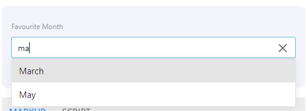
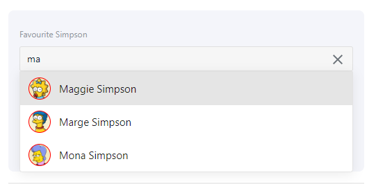

# OneReach test

## What is the task?

In order to show your skills and how fast you can learn you'll need to create simple app with an "Autocomplete" component.

Requirements: 
- autocomplete must accept on input next props:
    - `value` - value of selected element 
    - `getItems(text)` - function, which is return promise, which return `items` (array of objects which meet the filter criteria)
- autocomplete must to emit input event with chosen item (that will make it compatible with `v-model`)
- autocomplete must be cleared when focus is lost and none of the values is selected
- if `getItems` function return object with method `abort` - this method should be called when entering. Here the example: 
    - user enter _ge..._ (`getItems('ge')` function called)
    - user enter next symbol _get..._ (if previous promise `getItems('ge')` hasn't been resolved - we call `abort` function on previous promise)
- autocomplete must provide the ability to add custom styles for the elements of the drop-down list and customize the selected value (the current value of the dropdown). For example, the user should be able to get such a display format.
 
 

## How to submit a task?
### Using github
1. create a [fork](https://help.github.com/articles/fork-a-repo/) of this repository in a github.
1. complete tasks by changing source code of a project in your fork.
1. create a [pull request](https://help.github.com/articles/creating-a-pull-request/) on a github with your changes.

### In case you don't have github account (really?)
1. download sources of a repository
1. complete tasks by changing source code of a project in your local copy.
1. email modified source as a zip, but avoid adding `node_modules` into archive to reduce its size.

## Where to start?
Before you start coding you should understand main concept of `vue.js` especially its _reactivity_.

If you're not familiar with vue.js 2.0 **start by reading this [guide](https://vuejs.org/v2/guide/)**.

More detailed documentation can be found in [API](https://vuejs.org/v2/api/) section.
 
Also in order to complete tasks you'll need to get familiar with [keen-ui](https://josephuspaye.github.io/Keen-UI/) vue components.

## What you should do?
We encourage  you to:
 - use [ES6 features](http://es6-features.org/#Constants) in your JavaScript code
 - use [SASS](http://sass-lang.com/documentation/file.SASS_REFERENCE.html) (SCSS) instead of CSS
 - use [CSS flexbox](https://css-tricks.com/snippets/css/a-guide-to-flexbox/)
  
## What you should not do?
 - spend time setting up development environment
 - create simple app with Autocomplete component

## What matters most?
Your implementation will be judged based on:
 - understanding of vue.js concepts
 - code structure and readability
 - CSS/SASS markup approach

## FAQ
### Can I do tasks not in the order?
Yes, you may do tasks in any order you want.

### Can I use other npm packages?
Yes, you can use any packages you need, just don't forget to add them to `package.json` as a dependencies.

In case you need to add `jquery` to complete this task, you should read vue.js guides again (;

### Can I use SASS?
Yes, it's highly appreciated!

### Can I use LESS?
We suggest you to use SASS instead of LESS. 

You can use it, but you'll need to configure build process to process less properly

### How to debug vue.js application?
Debugging reactive application can be very tricky, so to help it we suggest to use Google Chrome with [vue-devtools](https://chrome.google.com/webstore/detail/vuejs-devtools/nhdogjmejiglipccpnnnanhbledajbpd?hl=en) 
 
